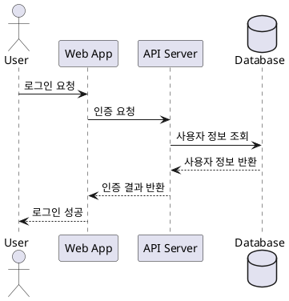

# AI 기반 소프트웨어 공학 

## 준비

- 보조 교재: 개발자를 위한 생성형 AI 활용 가이드 [길벗]

```plantuml
@startuml
actor User
participant "Web App" as App
participant "API Server" as API
database "Database" as DB

User -> App: 로그인 요청
App -> API: 인증 요청
API -> DB: 사용자 정보 조회
DB --> API: 사용자 정보 반환
API --> App: 인증 결과 반환
App --> User: 로그인 성공
@enduml
```
